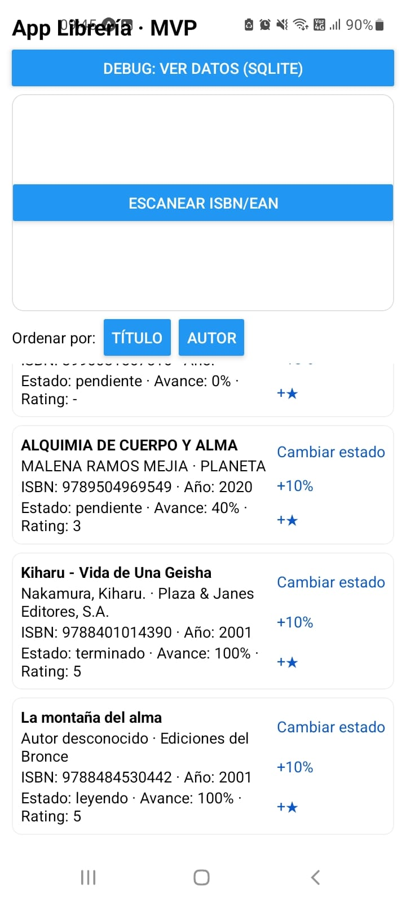
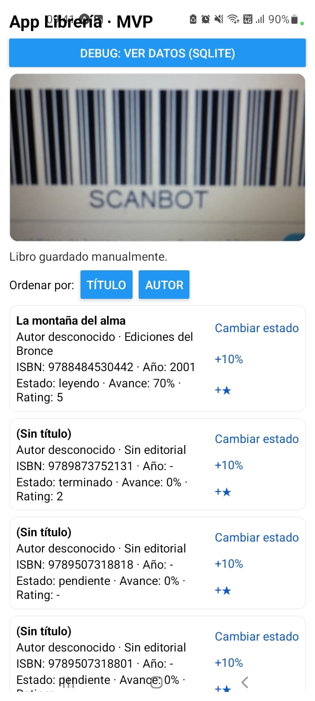
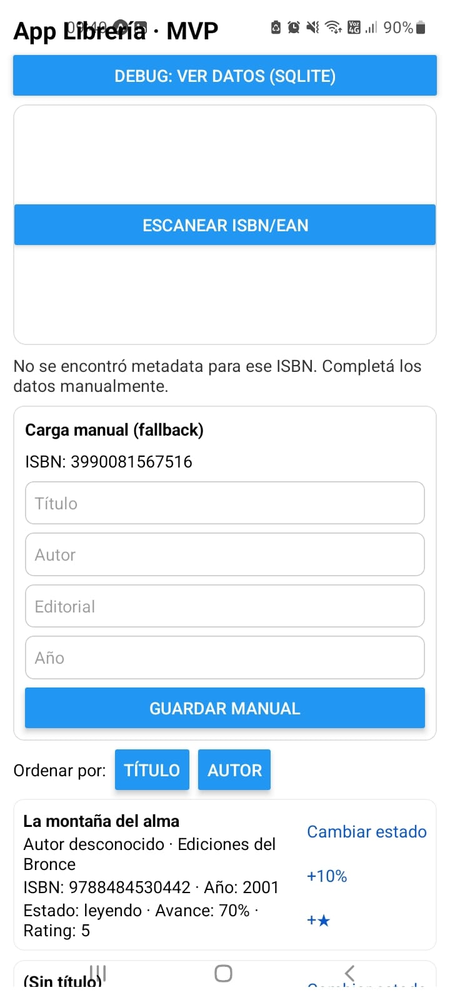

# App Librería

App móvil para registrar libros escaneando código de barras (ISBN/EAN).
Permite gestionar estado de lectura y datos básicos del libro.

Estado actual: MVP

## Estructura

- `mobile/`: app React Native (Expo) con:
  - escaneo ISBN/EAN por cámara
  - consulta de metadata por ISBN (Open Library)
  - persistencia local SQLite
  - listado ordenado por título/autor
  - edición rápida de estado, avance y rating

## Nota de arquitectura

Para la demo se prioriza SQLite local (offline-first). PostgreSQL queda para sincronización posterior.

### Screenshots (MVP)

> UI en estado MVP (funcional). Enfocada en lógica y persistencia, no en diseño visual.

| Listado y gestión | Escaneo ISBN/EAN | Carga manual (fallback) |
|---|---|---|
|  |  |  |